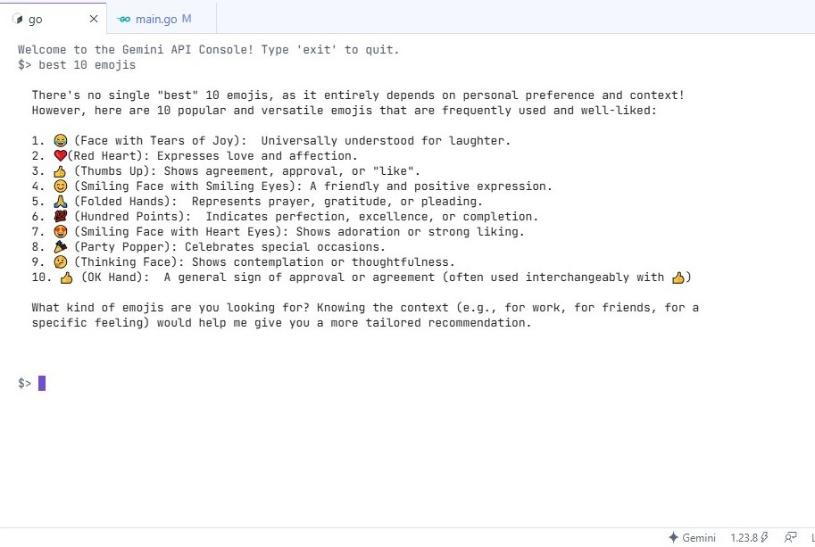

# Gemini API Console

A simple Go console app to chat with Gemini 1.5 Flash.

markdown
2.  

## Setup

1. Clone the repo:

```bash
git clone https://github.com/LeonibelDev/gemini-api-console
cd gemini-api-console
